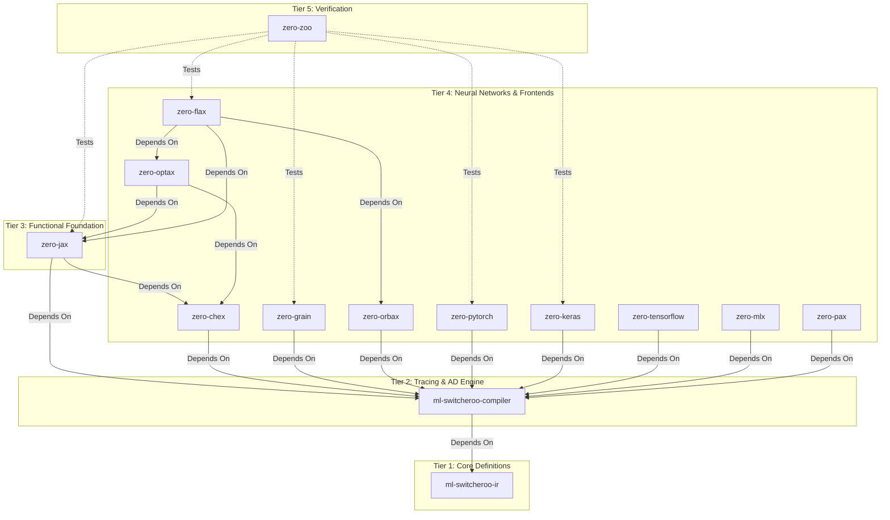
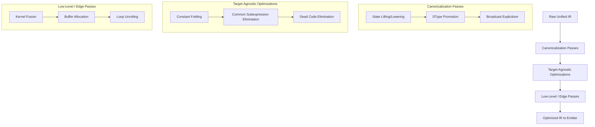
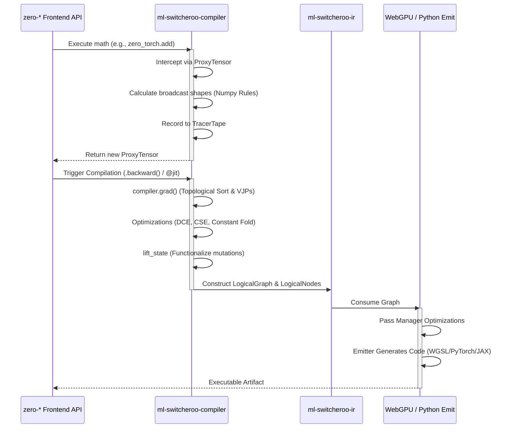

**Current Repository Context:** You are viewing the unified architecture documentation from within the `ml-switcheroo-compiler` repository.

# Abstract ML Machine Ecosystem Architecture

*Note: This architecture document is shared across all repositories in the `zero-*` and `ml-switcheroo-*` ecosystem to provide comprehensive technical context on how the frameworks interoperate.*

## The N-to-M Translation Problem

The Abstract ML Compiler ecosystem is designed to solve the $N \times M$ translation problem in Machine Learning. Instead of writing bespoke translators for every framework (JAX, PyTorch, Keras) to every target (WASM, WebGPU, TensorRT), we trace $N$ frontends into a strictly defined Intermediate Representation (IR), which is then consumed by $M$ backends.

This achieves a source-to-source and source-to-browser compilation pipeline utilizing **strictly zero external dependencies** (relying solely on the Python Standard Library and `numpy` for eager evaluations).

## Ecosystem Repository Taxonomy

The ecosystem is strictly hierarchical. Circular dependencies are forbidden. The repositories are organized into tiers:

### 1. `ml-switcheroo-ir` (Tier 1)
The universal, canonical dialect. Defines `LogicalNode` and `LogicalGraph`. Contains the schema validator enforcing ONNX spec compliance without requiring the heavy `onnx` pip package.

### 2. `ml-switcheroo-compiler` (Tier 2)
The computational heart of the ecosystem. See [Compiler Architecture Deep Dive](#compiler-architecture-deep-dive) below.

### 3. Frontends (`zero-*`) (Tiers 3 & 4)
**Crucial Architecture Note regarding `zero-*` repositories:** The existing `zero-*` codebases will be retained as independent, lightweight frontend API shells. Every `zero-*` repository depends on `ml-switcheroo-compiler` as its core backend dependency.

**The "No Math in Frontends" Rule:** All mathematical implementations, array allocations, gradient tracking logic, and computation graph building inside the `zero-*` repos are forbidden and must be replaced with delegations to the compiler. The `zero-*` repos purely handle framework-specific API routing, argument parsing (handling kwargs like `dim` vs `axis`), exception mimicry, and syntactic sugar.

* **`zero-jax`**: Mimics the JAX API (`jnp`, `lax`, `jit`, `grad`, `vmap`). Uses Pytree flattening to route state safely into the compiler tape.
* **`zero-pytorch`, `zero-keras`, `zero-tensorflow`, `zero-mlx`**: Mimic eager, object-oriented, and stateful semantics. They dynamically lift mutable states (like `nn.Parameter` or `tf.Variable`) into purely functional graph inputs/outputs via the compiler's internal `lift_state` pass.

### 4. `zero-zoo` (Tier 5)
The proving grounds. Contains identical architectural definitions (MLP, CNN, Micro-Transformer/NanoGPT) written across all frontends. Headless CI pipelines train these deterministically for 10 steps to assert `.allclose()` float-for-float equivalence ("Golden Seed" testing) across all simulated frameworks and final backend compilations.

---

# Compiler Architecture Deep Dive

The `ml-switcheroo-compiler` repository defines the core architecture mapping frontends to backends.

## 1. API Boundaries & Core Structures

### The Universal Tensor Interface
The base class `ml_switcheroo_compiler.Tensor` serves as the unified backend array.
- `zero_torch.tensor.Tensor` holds a `ml_switcheroo_compiler.Tensor` as its `.data` payload.
- `zero_jax.numpy.ndarray` subclasses or wraps `ml_switcheroo_compiler.Tensor`.

The tensor interface implements essential properties like `shape`, `dtype`, `device`, and `requires_grad`, enabling cross-framework compatibility natively.

### Configuration & State Management
A `ml_switcheroo_compiler.config` singleton controls the execution flow, tracking states like `eager_mode`, `default_float_dtype`, and `default_device`. The frameworks read this scoped context (also accessible via environment variables like `SWITCHEROO_EAGER_MODE=1`) to determine whether to execute operations eagerly or trace an IR graph.

### Error Handling Hierarchy
Specific error types such as `TracingError`, `CompilationError`, `ShapeMismatchError`, `DTypePromotionError`, `BackendNotSupportedError`, and `UnimplementedMathError` provide distinct traces depending on where execution fails during the pipeline.

## 2. Core Execution Engine Modes

### Eager Mode Engine
The immediate-execution path dispatches mathematical operations directly to NumPy or SciPy (the `ml_switcheroo_compiler.numpy_backend`). This mode uses a zero-copy `numpy.ndarray` wrapper to immediately evaluate operations, throwing `UnimplementedMathError` only when there is no direct mathematical equivalent.

### Graph Tracing Engine
Constructs the Intermediate Representation by tracking operations on proxy variables (`ml_switcheroo_compiler.tracing.ProxyTensor`). Proxy tensors overload all Python magic methods.
- Execution happens within a `GraphContext` (Thread-Local Storage) that records the execution tape.
- Frame inspection captures source-code line numbers for precise tracebacks.

### Automatic Differentiation (AD)
The tracing engine includes a comprehensive AutoDiff system:
- Forward-mode and Reverse-mode AD tapes.
- VJP and JVP registries for mathematical primitives.
- Mapped transparently to `zero_torch.autograd.backward` and `zero_jax.grad`.

### Higher-Order Control Flow
Implements universal cross-framework primitives (`cond`, `while_loop`, `scan`, `vmap`, `pmap`), mapping seamlessly from frontend loops and conditions down to IR blocks without Python runtime unrolling penalties.

## 3. Unified Intermediate Representation (IR) Schema

### Base Structures
- **IRGraph**: Represents the complete computation module, encapsulating Inputs, Outputs, and internal `IRNode`s.
- **IRNode**: Tracks individual operations with fields for `id`, `opcode`, `inputs`, `outputs`, `attributes`, and `metadata`.
- **IRBlock**: Defines nested scopes for complex control flow.
- **TensorSpec**: Maintains `shape`, `dtype`, and `sparsity`.

### Type & Shape System
Implements standard static types alongside dynamic typing through a `ShapeTracker`. A `SymInt` (Symbolic Integer) tracks dynamic dimensions like `batch_size`, and a Symbolic Expression Solver validates shape consistency mathematically before any actual data flows through.

### State Mutation & Aliasing
Because the backend operates functionally, `ReadVariable`, `AssignVariable`, and `ScatterUpdate` nodes represent mutations. For PyTorch, `nn.Parameter` assignments generate `AssignVariable` nodes, perfectly bridging PyTorch's OOP state mutations into JAX-compatible functional purity.

## 4. Middle-End Transformations (Pass Manager)

Before lowering to source code or executable backends, an internal `PassManager` applies topological sorting and runs iterative passes on the IR DAG until fixpoint convergence.

### Canonicalization Passes
- **StateLiftingPass/StateLoweringPass:** Converts explicit state assignments into functional I/O bounds.
- **AxisTranslationPass:** Globally injects `Transpose` nodes to convert between formats like NCHW and NHWC based on the target backend constraints.
- **DTypePromotionPass / BroadcastExplicitizerPass:** Eliminates all implicit casting and broadcasting by injecting explicit `Cast` and `BroadcastTo` nodes, simplifying the backend emitter's logic.

### Target-Agnostic Optimizations
Standard compiler passes such as Constant Folding, Dead Code Elimination (DCE), Common Subexpression Elimination (CSE), Algebraic Simplification, Mixed Precision casting, and BatchNorm folding.

### Low-Level Edge Passes
Advanced passes prep the graph for hardware execution: Elementwise Kernel Fusion, Scaled Dot-Product Attention matching, Buffer Allocation mapping for WebGPU/WASM linear memory arrays, and Loop Unrolling.

## 5. Emission Backends

### Python Source-to-Source (AST Generation)
Generates native Python scripts allowing one to "export" a trained JAX model explicitly as PyTorch code:
- **PyTorch:** Emits `torch.nn.Module` classes with `forward` topologies.
- **JAX/Flax:** Emits purely functional `apply_model(params, x)` functions with JAX PyTrees.
- **Keras / TensorFlow / MLX:** Emits functional topologies tailored to those libraries.

### Edge & Web Native Backends
- **WebGPU:** Translates the IR directly into Jinja2-templated WGSL shaders (calculating workgroup layouts, buffer bindings, and memory allocations) alongside a JS Orchestrator script.
- **WebGL 2.0:** A fallback mapping 2D fragment textures to computation matrices.
- **WASM SIMD:** Emits C++ standard headers implementing operations via hardware intrinsics (`wasm_f32x4_*`), compiled silently using `emcc` into executable modules.
- **ONNX:** Native mapping from the IR schema to ONNX opset `.proto` configurations.

---

## Compilation Pipeline & Data Flow

When a user executes code in any `zero-*` frontend, the framework delegates the logic to the backend pipeline, mapping high-level API calls down to executable WASM/WebGPU binary code.

### Trace-to-AST Linking
To provide clear error messages and allow for framework-specific syntactic rewrites, the compiler dynamically links trace operations to the original Python syntax trees. Leveraging `inspect.currentframe()`, every `LogicalNode` emitted into the IR captures a `source_ast_ref` binding it back to the exact file path, line number, and AST ID in the user's source code.

## 6. Rearchitecture 2026: Strict Architectural Separation
In 2026, the architecture was upgraded to enforce a strict backend-focused decoupling paradigm:
- **Frontend Independence (The "No API Shell" Rule):** The compiler engine (`ml-switcheroo-compiler`) was stripped of all Tier 3/4 framework mimicry. Mock layers for Flax, Orbax, JAX's `lax` namespace, and Keras abstractions were fully purged. The compiler strictly defines universal, backend-agnostic mathematical operations (`ml_switcheroo_compiler.ops`).
- **N-to-M Universal Utility:** Any operation or transformation pass added to the compiler must be fundamentally useful to multiple frontends. Foreign operations are now represented by a universal `ForeignCall` proxy.
- **Pluggable Backend Registry**: The compiler backends are fully decoupled via `ml_switcheroo_compiler.backends.registry.BackendRegistry`. Backends (including `numpy`, `jax`, `mlx`, `cupy`, `dusk`, `torch`, and `keras`) are registered dynamically using the `@register_backend("name")` decorator. This $N \times M$ architecture allows adding new target emitters without modifying the core compiler code.
