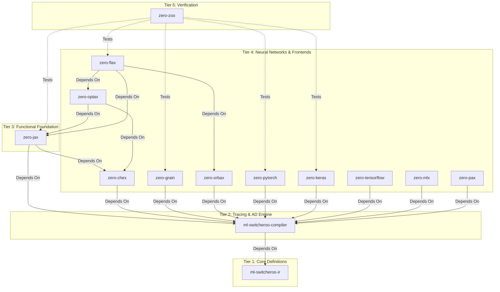
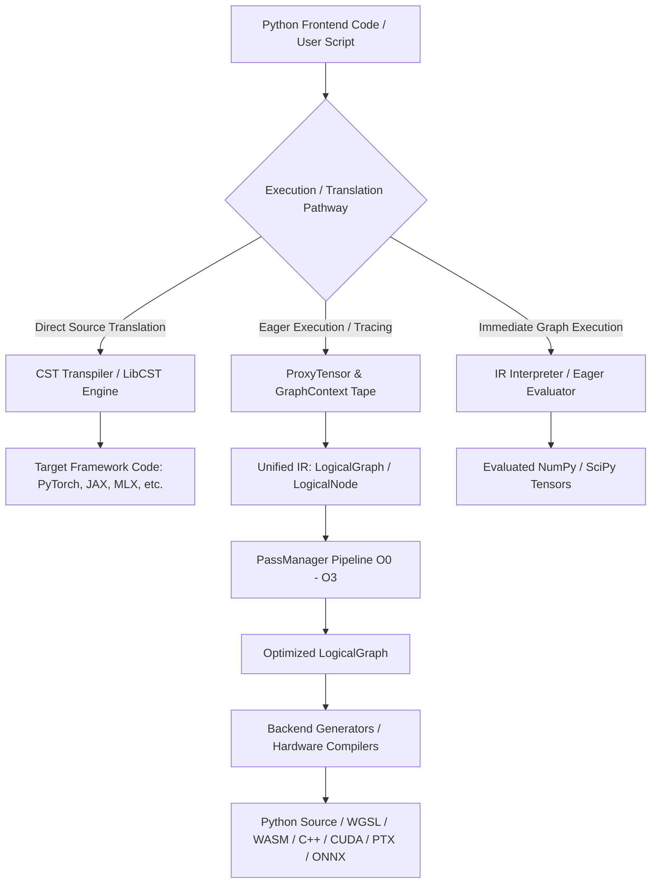
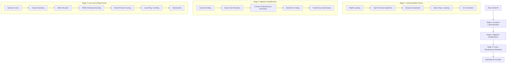
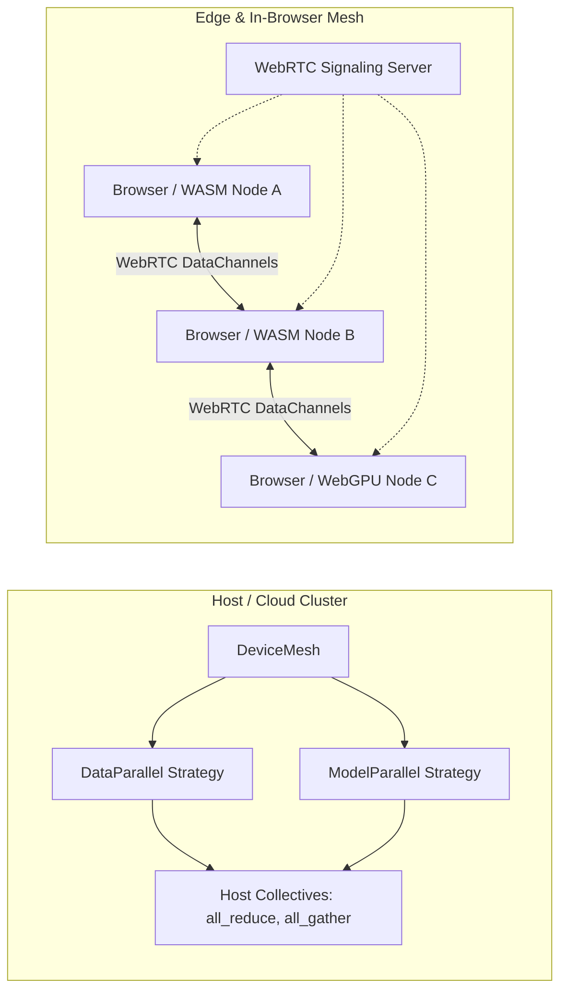
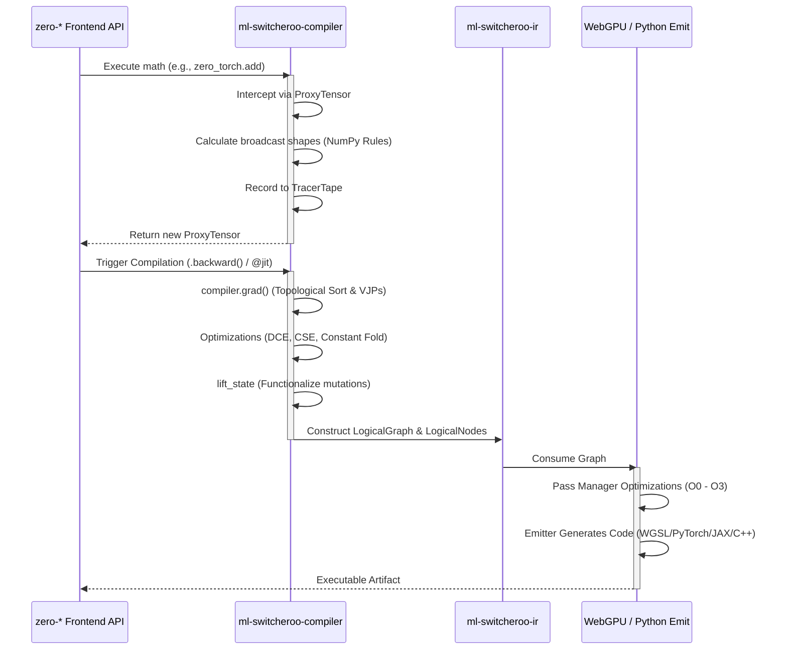

**Current Repository Context:** You are viewing the unified architecture documentation from within the `ml-switcheroo-compiler` repository.

# Abstract ML Machine Ecosystem Architecture

*Note: This architecture document is shared across all repositories in the `zero-*` and `ml-switcheroo-*` ecosystem to provide comprehensive technical context on how the frameworks interoperate.*

## The N-to-M Translation Problem

The Abstract ML Compiler ecosystem is designed to solve the $N \times M$ translation problem in Machine Learning. Instead of writing bespoke translators for every framework (JAX, PyTorch, Keras) to every target (WASM, WebGPU, CUDA, TensorRT), we trace or parse $N$ frontends into a strictly defined Intermediate Representation (IR), which is then consumed by $M$ backends.

This achieves a source-to-source and source-to-browser compilation pipeline utilizing strictly controlled, lightweight dependencies (`ml-switcheroo-ir`, `numpy`, `scipy`, `libcst`, `pydantic`, `pyyaml`, and `h5py` for serialization, with zero runtime framework lock-in).

## Ecosystem Repository Taxonomy

The ecosystem is strictly hierarchical. Circular dependencies are forbidden. The repositories are organized into tiers:

### 1. `ml-switcheroo-ir` (Tier 1)
The universal, canonical dialect. Defines `LogicalNode` and `LogicalGraph`. Contains the schema validator enforcing ONNX and graph specification compliance without requiring heavyweight external dependencies.

### 2. `ml-switcheroo-compiler` (Tier 2)
The computational heart of the ecosystem. See [Compiler Architecture Deep Dive](#compiler-architecture-deep-dive) below.

### 3. Frontends (`zero-*`) (Tiers 3 & 4)
**Crucial Architecture Note regarding `zero-*` repositories:** The existing `zero-*` codebases are independent, lightweight frontend API shells. Every `zero-*` repository depends on `ml-switcheroo-compiler` as its core backend dependency.

**The "No Math in Frontends" Rule:** All mathematical implementations, array allocations, gradient tracking logic, and computation graph building inside the `zero-*` repos are forbidden and must be replaced with delegations to the compiler. The `zero-*` repos purely handle framework-specific API routing, argument parsing (handling kwargs like `dim` vs `axis`), exception mimicry, and syntactic sugar.

* **`zero-jax`**: Mimics the JAX API (`jnp`, `lax`, `jit`, `grad`, `vmap`). Uses PyTree flattening to route state safely into the compiler tape.
* **`zero-pytorch`, `zero-keras`, `zero-tensorflow`, `zero-mlx`**: Mimic eager, object-oriented, and stateful semantics. They dynamically lift mutable states (like `nn.Parameter` or `tf.Variable`) into purely functional graph inputs/outputs via the compiler's internal `lift_state` pass.

### 4. `zero-zoo` (Tier 5)
The proving grounds. Contains identical architectural definitions (MLP, CNN, Micro-Transformer/NanoGPT) written across all frontends. Headless CI pipelines train these deterministically for 10 steps to assert `.allclose()` float-for-float equivalence ("Golden Seed" testing) across all simulated frameworks and final backend compilations.

---

# Compiler Architecture Deep Dive

The `ml-switcheroo-compiler` repository defines the core architecture mapping frontends to backends.

## 1. API Boundaries & Core Structures

### The Universal Tensor Hierarchy
The compiler defines first-class tensor abstractions exported from `ml_switcheroo_compiler`:
- **`Tensor`**: Serves as the unified multidimensional backend array. Frontends wrap this class (e.g., `zero_torch.tensor.Tensor` holds `ml_switcheroo_compiler.Tensor` as `.data`, and `zero_jax.numpy.ndarray` wraps it). Implements `shape`, `dtype`, `device`, `requires_grad`, and full Python magic methods.
- **`RaggedTensor`**: Represents non-uniform, nested tensor dimensions with ragged row splits.
- **`SparseTensor`**: Implements sparse tensor representations (e.g., coordinate list / COO) for memory-efficient sparse linear algebra.
- **`TensorArray`**: Supports dynamically indexable, growable, and writable sequences of tensors for loop execution and dynamic control flow.
- **`Dataset`**: Core functional pipeline abstractions for batched tensor transforms and streaming data evaluation.

### Configuration & State Management
A `ml_switcheroo_compiler.config` singleton controls execution flow, tracking options like `eager_mode`, `default_float_dtype`, and `default_device`. Frameworks read this scoped context (also accessible via environment variables like `SWITCHEROO_EAGER_MODE=1`) to determine whether to execute operations eagerly or trace an IR graph.

### Error Handling Hierarchy
Specific error types such as `TracingError`, `CompilationError`, `ShapeMismatchError`, `DTypePromotionError`, `BackendNotSupportedError`, and `UnimplementedMathError` provide distinct diagnostics depending on where execution fails during the pipeline.

## 2. Core Execution Engine Modes & Pathways

The compiler supports three primary execution and translation pathways:

### Eager Mode Engine & Interpreter
- **NumPy/SciPy Eager Backend**: The immediate-execution path dispatches mathematical operations directly to NumPy and SciPy under `ml_switcheroo_compiler.backends.eager`.
- **Graph Interpreter (`evaluate_graph`)**: Located in `ml_switcheroo_compiler.interpreter.evaluator`, it traverses a `LogicalGraph` in topological order to execute operations on concrete inputs without generating intermediate source code or invoking an external compiler.

### Graph Tracing Engine
Constructs the Intermediate Representation by intercepting operations on proxy variables (`ml_switcheroo_compiler.tracing.ProxyTensor`). Proxy tensors overload all Python magic methods.
- Execution occurs within `GraphContext` (Thread-Local Storage) tracking the execution tape.
- Frame inspection (`inspect.currentframe()`) captures source-code line numbers and AST references (`source_ast_ref`) for precise tracebacks.

### Automatic Differentiation (AD)
The tracing engine includes a comprehensive AutoDiff system (`ml_switcheroo_compiler.grad`):
- Reverse-mode (`grad`, `value_and_grad`) and forward-mode (`jacfwd`, `jvp`) AD engines.
- VJP and JVP registries for mathematical primitives, registered via `@register_vjp` and `@register_jvp`.
- Higher-order derivatives (Hessian, HvP, Jacobians).
- Memory-budgeted checkpointing (`checkpointing.py`) implementing dynamic programming (Knapsack) and binomial rematerialization schedules.

### Higher-Order Control Flow
Implements universal cross-framework primitives (`cond`, `while_loop`, `scan`, `vmap`, `pmap`), mapping seamlessly from frontend loops and conditions down to IR blocks without Python runtime unrolling penalties.

### Concrete Syntax Tree (CST) Source-to-Source Transpiler
Located in `ml_switcheroo_compiler.backends.cst_transpiler`:
- Uses `libcst` to perform direct source-to-source transpilation across frameworks without requiring runtime graph tracing.
- Features `ASTPatternMatcher`, `CSTTransformer`, and `StateLiftingTransformer` for:
  - Framework import mapping (e.g. `torch.nn` $\leftrightarrow$ `jax.nn` $\leftrightarrow$ `mlx.core.nn`).
  - Rewriting arguments and keyword differences (e.g., `dim` vs. `axis`, `keepdim` vs. `keepdims`).
  - Stateful OOP class to functional parameter dictionary (PyTree) lifting and vice-versa.
  - Parameter and attribute access remapping.

## 3. Unified Intermediate Representation (IR) Schema

### Base Structures
- **`IRGraph` (`LogicalGraph`)**: Represents the complete computation module, encapsulating inputs, outputs, and internal node mappings (`nodes: dict[str, LogicalNode]`).
- **`IRNode` (`LogicalNode`)**: Tracks individual operations with fields:
  - `id`: Unique identifier for the node.
  - `op_type`: Canonical operation operator string (e.g., `"Add"`, `"Conv"`, `"MatMul"`).
  - `domain`: Operator domain namespace (e.g., `""`, `"ai.onnx"`).
  - `inputs`: Ordered list of input node IDs.
  - `outputs`: Optional list of output node IDs.
  - `attributes`: Key-value attribute dictionary (`dict[str, AttributeValue]`).
  - `shape_metadata`: Output tensor shape tuple.
  - `output_specs`: Formal `list[TensorSpec]` defining shapes, dtypes, and sparsity.
  - `source_ast_ref`: Source file path, line number, and AST identifier for error localization.
  - `sharding`: SPMD sharding specification and partition metadata.
  - `device`: Target device placement metadata.
  - `stream`: Execution stream or queue identifier.
  - `subgraphs`: Scoped control flow and functional blocks encapsulated within `dict[str, LogicalGraph]` (e.g., `"body"`, `"cond"`, `"then_branch"`, `"else_branch"`).
- **`TensorSpec` & `DType`**: Maintain explicit dimensions, dynamic symbols (`SymInt`), precision formats, and sparsity layouts.
- **`ZeroTangent` / `NoTangent`**: Explicit IR node representations for zero-gradient and non-differentiable execution paths.

### Type & Shape System
Implements standard static types alongside dynamic typing through `ShapeTracker`. A `SymInt` (Symbolic Integer) tracks dynamic dimensions like `batch_size`, and a Symbolic Expression Solver validates shape consistency mathematically before any actual data flows through.

### State Mutation & Aliasing
Because the backend operates functionally, `ReadVariable`, `AssignVariable`, and `ScatterUpdate` nodes represent mutations. For PyTorch, `nn.Parameter` assignments generate `AssignVariable` nodes, perfectly bridging PyTorch's OOP state mutations into JAX-compatible functional purity.

## 4. Middle-End Transformations (Pass Manager)

Before lowering to source code or executable backends, an internal `PassManager` applies topological sorting and runs iterative passes on the IR DAG until fixpoint convergence. Passes are configured across optimization levels (`O0` to `O3`) defined in `pass_pipeline.yaml`.

### Canonicalization Passes
- **`PolyfillLoweringPass`**: Rewrites composite frontend operations into canonical elementary primitives.
- **`StateLiftingPass` / `StateLoweringPass`**: Converts mutable state assignments into explicit functional inputs and outputs.
- **`AxisTranslationPass`**: Injects `Transpose` nodes to reconcile differing tensor layout conventions (such as NCHW vs NHWC).
- **`TypePromotionExplicitizerPass` & `BroadcastExplicitizerPass`**: Eliminates implicit casting and broadcasting by inserting explicit `Cast` and `BroadcastTo` nodes.

### Target-Agnostic Optimizations
- **`ConstantFoldingPass`**: Pre-computes static subgraphs with eager evaluation.
- **`DeadCodeEliminationPass` (DCE)**: Prunes unreferenced nodes from the IR graph.
- **`CommonSubexpressionEliminationPass` (CSE)**: Merges structurally identical operations using structural hashing.
- **`BatchNormFoldingPass`**: Merges batch normalization weights directly into adjacent convolutional filters.
- **`ParallelScanPass`**: Optimizes associative prefix scans into logarithmic-depth parallel patterns.

### Low-Level, Hardware & Distributed Passes
- **`OperatorFusionPass`**: Fuses consecutive elementwise and reduction kernels.
- **`GraphSchedulingPass`**: Generates memory-optimal topological execution orderings.
- **`BufferAllocationPass`**: Plans contiguous, reuse-aware linear memory buffer offsets for WebGPU and WASM runtimes.
- **`SPMDPass`**: Inserts distributed collective operations (`all_reduce`, `all_gather`, `reduce_scatter`) according to device mesh sharding annotations.
- **`MixedPrecisionPass` & `QuantizationPass`**: Handles FP16/BF16 downcasting and INT8/INT4 quantization.
- **`LoopTilingPass`, `LoopUnrollingPass`, and `VectorizationPass`**: Hardware-level optimizations generating SIMD-friendly compute strides.

## 5. Distributed Runtime & WebRTC Mesh

Located in `ml_switcheroo_compiler.distributed`:

- **Topologies & Sharding**: `DeviceMesh` organizes multi-dimensional hardware topologies. `Distribution` strategies (`DataParallel`, `ModelParallel`), `LayoutMap`, and `ShardingSpec` annotate tensors for SPMD graph partitioning.
- **Distributed Collectives**: `all_reduce`, `all_gather`, `reduce_scatter`, `broadcast`, and `shard_tensor` execute across MPI, backend-native primitives, or simulated host runners.
- **WebRTC Edge Mesh**: The compiler includes a WebRTC signaling protocol (`webrtc_signaling.py`) and WebRTC-based collective execution layer (`backends/edge/distributed_webrtc/`), enabling distributed browser-to-browser and edge-to-edge training without central host bottlenecks.

## 6. Emission Backends & Target Compilers

Backends are registered dynamically with the `@register_backend("name")` decorator via `ml_switcheroo_compiler.backends.registry.BackendRegistry`.

### Python Source-to-Source Backends
- **PyTorch (`pytorch`)**: Generates `torch.nn.Module` classes and functional PyTorch execution scripts.
- **JAX (`jax`)**: Generates purely functional JAX topologies leveraging PyTrees and `jax.numpy`.
- **MLX (`mlx`)**: Emits native Apple Silicon MLX functional modules.
- **Keras (`keras`) & TensorFlow (`tensorflow`)**: Emits modern Keras 3 or TensorFlow graph topologies.
- **NumPy (`numpy`) & SciPy**: Generates vectorized Python/NumPy baseline scripts.
- **CuPy (`cupy`)**: Emits CUDA-accelerated CuPy array scripts.
- **Dask (`dask`)**: Emits distributed Dask Array computation graphs.
- **Numba (`numba`)**: Emits JIT-compiled `@njit` kernels for accelerated CPU/GPU loops.
- **Sparse (`sparse`, `sparse_coo`)**: Emits sparse matrix code utilizing coordinate/COO structures.

### Hardware Backends & Kernel Code Generation
- **CPU (LLVM / C++) (`llvm_cpp`)**: Generates vectorized, optimized C++17 implementations.
- **CUDA / PTX (`cuda`)**: Generates native CUDA `.cu` source code with custom thread block layouts.
- **ROCm (`rocm`)**: Emits HIP kernels targeted at AMD GPU architectures.
- **Metal Shading Language (`metal`)**: Generates MSL compute shader source code for Apple Silicon GPUs.

### Edge & Web Native Backends
- **WebGPU (`edge_wgsl`)**: Translates IR operations into WGSL compute shaders, workgroup layouts, buffer bindings, and JavaScript orchestrator harnesses.
- **WebGL 2.0 (`edge_webgl`)**: Fallback execution mapping compute tensors to 2D fragment textures.
- **WASM SIMD (`wasm`)**: Emits C++ headers using 128-bit hardware intrinsics (`wasm_f32x4_*`), compilable silently with `emcc` into standalone WebAssembly binaries.
- **ONNX (`onnx`)**: Lowers IR directly into ONNX serialization models without requiring the heavy `onnx` Python package.
- **StableHLO (`stablehlo`)**: Emits MLIR-compliant StableHLO bytecode and textual representations for OpenXLA integration.

## 7. Diagnostics, Profiling & Export

### Diagnostics & Anomaly Detection
Located in `ml_switcheroo_compiler.diagnostics`:
- **`flop_counter`**: Analyzes `LogicalGraph` structures to calculate exact theoretical FLOPS and MAC operations.
- **`memory_profiler`**: Analyzes peak working-set memory requirements and buffer life cycles.
- **`numerical_anomaly`**: Instruments execution to detect NaNs, infinities, and gradient vanishing/exploding.
- **`shape_debugger`**: Tracks symbolic dynamic shapes and dimension compatibility through the pipeline.

### Export & Ahead-Of-Time (AOT) Compilation
Located in `ml_switcheroo_compiler.export`:
- **AOT Engine (`aot.py`)**: Packages optimized models into pre-compiled deployment artifacts.
- **Model Serialization (`export_api.py`, `pb_utils.py`)**: Supports exporting computation graphs directly to TensorFlow SavedModel Protobuf format and HDF5 weight bundles without external framework runtimes.

---

## Compilation Pipeline & Data Flow

When a user executes code in any `zero-*` frontend, the framework delegates the logic to the backend pipeline, mapping high-level API calls down to executable WASM/WebGPU binary code or target framework source code.

### Trace-to-AST Linking
To provide clear error messages and allow for framework-specific syntactic rewrites, the compiler dynamically links trace operations to the original Python syntax trees. Leveraging `inspect.currentframe()`, every `LogicalNode` emitted into the IR captures a `source_ast_ref` binding it back to the exact file path, line number, and AST ID in the user's source code.

---

## 8. Architectural Boundaries & Decoupling Guarantees

In 2026, the architecture was upgraded to enforce strict backend-focused decoupling:
1. **Frontend Independence (The "No API Shell" Rule):** The compiler engine (`ml-switcheroo-compiler`) is stripped of all Tier 3/4 framework mimicry. Mock layers for Flax, Orbax, JAX's `lax` namespace, and Keras abstractions were fully purged. The compiler strictly defines universal, backend-agnostic mathematical operations (`ml_switcheroo_compiler.ops`).
2. **N-to-M Universal Utility:** Any operation or transformation pass added to the compiler must be fundamentally useful to multiple frontends. Foreign operations are represented by a universal `ForeignCall` proxy.
3. **Pluggable Backend Registry:** The compiler backends are decoupled via `ml_switcheroo_compiler.backends.registry.BackendRegistry`. Backends are registered dynamically using `@register_backend("name")`. This allows adding new target emitters without modifying the core compiler code.
4. **Parity Rules:** Each backend must natively implement 1:1 behavioral parity for all operations without cross-backend fallback to NumPy or PyTorch.
