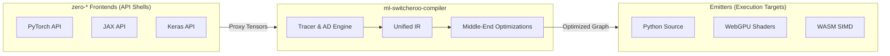

# zero-* Engine Core

> **Note:** This repository serves as the core execution engine and abstract representation framework for the `zero-*` ecosystem.

# [ml-switcheroo-compiler](https://github.com/SamuelMarks/ml-switcheroo-compiler)

The `ml-switcheroo-compiler` is the universal hub and core execution engine for the ML Switcheroo ecosystem. It provides a robust intermediate representation (IR) and compilation pipeline to seamlessly translate machine learning models between major Python frameworks and compile them directly for highly optimized edge execution.

## Architectural Vision

The compiler resolves the impedance mismatch between different machine learning paradigms, operating as a strictly decoupled, purely functional computational hub (Tier 2) with two primary targets:

1. **Source-to-Source (AST-to-AST) Transpilation:** Seamlessly convert ML logic between frameworks like PyTorch, Keras, JAX, and MLX. This includes state lifting/lowering, explicit broadcasting rules, and mapping ecosystem-specific quirks using our universal Intermediate Representation (IR).
2. **Direct-to-Edge Compilation:** Bypass Python deployment entirely by lowering the Unified IR down to highly optimized browser and edge executables powered by **WebGPU** and **WASM SIMD**.

**Strict Decoupling Rule ("No Math in Frontends"):** The `ml-switcheroo-compiler` repository is exclusively responsible for all math, Automatic Differentiation (AD), and transformations. Frontend repositories (like `zero-pytorch` or `zero-jax`) contain NO math implementations; they are purely Tier 3/4 lightweight API shells that route inputs and lift object-oriented state into this compiler. Likewise, this compiler strictly forbids any framework-specific API mimicry.

Please refer to [`ARCHITECTURE.md`](ARCHITECTURE.md) for an in-depth dive into the compiler's architecture, including its intermediate representation, execution engine modes, and transformation pipeline.

## Compilation Pipeline

- **Unified IR:** A strict, framework-agnostic intermediate representation defining shape semantics, mathematical primitives, control flow, and state management.
- **Middle-End Optimization:** Executes high-level passes (state transformation, type promotion) and low-level passes (buffer allocation, kernel fusion, loop tiling) before code generation.
- **Python Emission:** Emits idiomatic source code for the target Python framework (e.g., PyTorch `nn.Module`s, JAX Pytrees, Keras subclassed models, MLX classes).
- **Web & Edge Emission:** Translates computation graphs into WGSL shaders for WebGPU parallel compute and C++/Rust for WASM SIMD (v128) CPU compute.

## Advanced Transformations and Distributed Support

The engine supports a comprehensive suite of advanced optimizations and parity features across all backends:
- **Compiler Optimizations:** Built-in Dead Code Elimination (DCE), Common Subexpression Elimination (CSE), Constant Folding, Operator Fusion, Loop Unrolling, Memory Planning, and Scheduling logic via the `PassManager`.
- **Automatic Differentiation:** Full support for `jvp` (Forward-Mode), `vjp` / `grad` (Reverse-Mode), and `hvp` (Higher-Order Derivatives), accompanied by memory-efficient checkpointing/rematerialization and custom gradient hooks.
- **Hardware Targets:** Support for LLVM/C++ fallbacks, WebAssembly (WASM), WebGPU WGSL, ONNX, and StableHLO native exports.
- **Distributed Parity:** Collectives (`AllReduce`, `AllGather`, `AllToAll`, `ReduceScatter`), SPMD annotations, and pipeline parallelism primitives.

## Core Execution Modes

To provide a standard developer experience, the engine supports two distinct execution paradigms:

- **Eager Mode (Debug / Interactive):** Immediate-execution path where mathematical operations are evaluated eagerly, backed by NumPy or pure Python for accurate, host-level execution without compilation overhead.
- **Graph Mode (Compiled):** A tracing and parsing execution path that constructs the Unified IR. The resulting computation graph is then routed through the optimization middle-end to the selected deployment backend.

## Internal Backends

The `ml-switcheroo-compiler` serves as the unifying engine for the `zero-*` ecosystem. While the frontends provide the API interfaces, the actual execution is delegated to one of several internal execution backends. You can specifically choose between the following backends depending on your platform and performance requirements:

- **`numpy`**: Reference eager execution CPU backend.
- **`jax`**: High-performance compiler and array library backend.
- **`mlx`**: Apple Silicon optimized array framework backend.
- **`cupy`**: GPU-accelerated array computing backend.
- **`dusk`**: Specialized distributed or alternative backend.
- **`torch`**: Native PyTorch execution backend.
- **`keras`**: Keras execution backend.

---

## Related Projects

| Name | Description | CI Shields |
|---|---|---|
| [`ml-framework-snapshots`](https://github.com/SamuelMarks/ml-framework-snapshots) | Static API extraction and schema formalization for major ML frameworks. |  |
| [`ml-switcheroo-ir`](https://github.com/SamuelMarks/ml-switcheroo-ir) | The core dependency-free IR for the ml-switcheroo model translation ecosystem. |  |
| [`zero-chex`](https://github.com/SamuelMarks/zero-chex) | Chex is a library of utilities for helping to write reliable JAX code. |  |
| [`zero-flax`](https://github.com/SamuelMarks/zero-flax) | Flax is a neural network library for JAX that is designed for flexibility. |  |
| [`zero-grain`](https://github.com/SamuelMarks/zero-grain) | Library for reading and processing ML training data. |  |
| [`zero-jax`](https://github.com/SamuelMarks/zero-jax) | Composable transformations of Python+NumPy programs: differentiate, vectorize, JIT to GPU/TPU, and more |  |
| [`zero-keras`](https://github.com/SamuelMarks/zero-keras) | Deep Learning for humans |  |
| [`zero-mlx`](https://github.com/SamuelMarks/zero-mlx) | MLX: An array framework for Apple silicon |  |
| [`zero-optax`](https://github.com/SamuelMarks/zero-optax) | Optax is a gradient processing and optimization library for JAX. |  |
| [`zero-orbax`](https://github.com/SamuelMarks/zero-orbax) | Orbax provides common checkpointing and persistence utilities for JAX users |  |
| [`zero-pax`](https://github.com/SamuelMarks/zero-pax) | Pax is a Jax-based machine learning framework for training large scale models. Pax allows for advanced and fully configurable experimentation and parallelization, and has demonstrated industry leading model flop utilization rates. |  |
| [`zero-pytorch`](https://github.com/SamuelMarks/zero-pytorch) | Tensors and Dynamic neural networks in Python with strong GPU acceleration |  |
| [`zero-tensorflow`](https://github.com/SamuelMarks/zero-tensorflow) | An Open Source Machine Learning Framework for Everyone |  |

---

## License

Licensed under either of

- Apache License, Version 2.0 (LICENSE-APACHE or https://www.apache.org/licenses/LICENSE-2.0)
- MIT license (LICENSE-MIT or https://opensource.org/licenses/MIT)

at your option.

### Contribution

Unless you explicitly state otherwise, any contribution intentionally submitted
for inclusion in the work by you, as defined in the Apache-2.0 license, shall be
dual licensed as above, without any additional terms or conditions.
