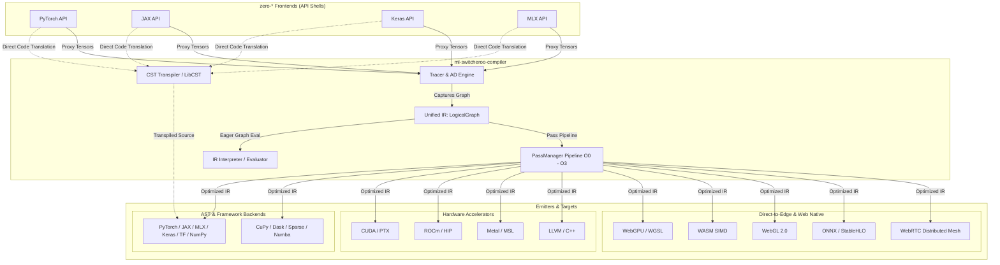
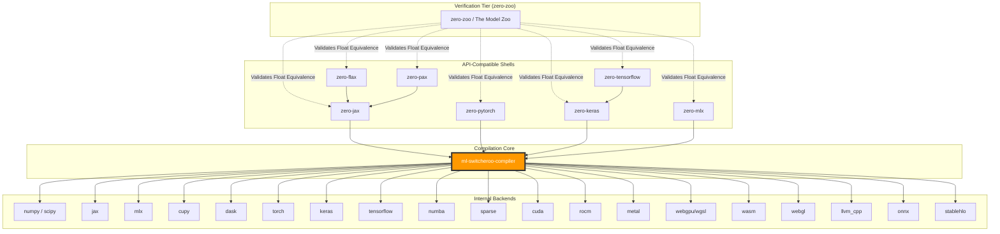

# zero-* Engine Core

> **Note:** This repository serves as the core execution engine and abstract representation framework for the `zero-*` ecosystem.

# [ml-switcheroo-compiler](https://github.com/SamuelMarks/ml-switcheroo-compiler)

The `ml-switcheroo-compiler` is the universal hub and core execution engine for the ML Switcheroo ecosystem. It provides a robust intermediate representation (IR), a direct Concrete Syntax Tree (CST) transpiler, and a multi-stage compilation pipeline to seamlessly translate machine learning models between major Python frameworks and compile them directly for highly optimized hardware, edge, and browser execution.

Crucially, this architecture empowers developers to run precise forward and backward passes directly in the browser for exact shape learning, to coordinate peer-to-peer distributed browser training meshes over WebRTC, and to empirically benchmark any ML syntax across different execution backends.

## Core Data Structures

Exported directly from the root namespace (`ml_switcheroo_compiler`), the compiler defines a unified tensor hierarchy:
- **`Tensor`**: The universal dense multidimensional array backing all frontend interfaces (e.g. `zero-pytorch`, `zero-jax`).
- **`RaggedTensor`**: First-class representation for non-uniform, nested tensor dimensions with ragged splits.
- **`SparseTensor`**: Memory-efficient coordinate list (COO) representation for sparse linear algebra.
- **`TensorArray`**: Dynamically indexable, growable, and writable sequences of tensors for dynamic control flow loops.
- **`Dataset`**: Functional data transformation pipelines and batched streaming iterators.

## Major Project Goals

1. **In-Browser Shape Learning & Transpilation:** Enhance the original [ML Switcheroo](https://samuelmarks.github.io/ml-switcheroo) project (focused on ML framework and SASS/RDNA transpilation) with the ability to learn precise tensor shapes by executing actual forward and backward passes directly in the browser.
2. **Cross-Backend Benchmarking:** Benchmark different execution backends independently of the frontend API (e.g., testing TensorFlow syntax running on the MLX backend). This allows us to empirically test hardware-specific performance claims—such as whether PyTorch is truly better for GPUs, JAX for TPUs, or MLX for Apple Silicon.
3. **Decentralized Edge & Browser Mesh:** Enable distributed, serverless peer-to-peer collective execution (`AllReduce`, `AllGather`) directly across WebAssembly and WebGPU clients using built-in WebRTC signaling and data channels.

## Architectural Vision

The compiler resolves the impedance mismatch between different machine learning paradigms, operating as a strictly decoupled, purely functional computational hub (Tier 2) with three primary targets:

1. **Source-to-Source (AST / CST) Transpilation:** Seamlessly convert ML source code between frameworks like PyTorch, Keras, JAX, and MLX. Uses `libcst` for direct syntax transformation (rewriting arguments, mapping modules, and lifting stateful OOP classes into pure PyTree parameter dictionaries) as well as the Unified IR for full semantic re-emission.
2. **Hardware Acceleration & Kernel Generation:** Lower computation graphs into native GPU and accelerator kernels targeting NVIDIA CUDA (`.cu`), AMD ROCm/HIP, Apple Silicon Metal Shading Language (MSL), Numba JIT, and LLVM/C++ vectorized CPU routines.
3. **Direct-to-Edge & Browser Compilation:** Bypass Python runtimes by lowering the Unified IR down to browser and edge executables powered by **WebGPU** (WGSL), **WebGL 2.0**, and **WASM SIMD** (v128 C++ intrinsics), or export to standardized exchange formats (**ONNX**, **StableHLO**).

**Strict Decoupling Rule ("No Math in Frontends"):** The `ml-switcheroo-compiler` repository is exclusively responsible for all math, Automatic Differentiation (AD), and transformations. Frontend repositories (like `zero-pytorch` or `zero-jax`) contain NO math implementations; they are purely Tier 3/4 lightweight API shells that route inputs and lift object-oriented state into this compiler. Likewise, this compiler strictly forbids any framework-specific API mimicry.

Please refer to [`ARCHITECTURE.md`](ARCHITECTURE.md) for an in-depth dive into the compiler's architecture, including its intermediate representation, execution engine modes, and transformation pipeline.

## Compilation Pipeline

- **Unified IR:** A strict, framework-agnostic intermediate representation (`LogicalGraph` / `LogicalNode`) defining precise shape semantics (learned via live forward/backward passes), mathematical primitives, control flow, and state management.
- **Middle-End Optimization:** Executes multi-stage optimization passes configured from `O0` to `O3` (canonicalization, constant folding, CSE, DCE, operator fusion, buffer allocation, loop tiling, vectorization, and SPMD partitioning) before code generation.
- **Python Emission & CST Transpilation:** Emits idiomatic source code for target frameworks or directly rewrites syntax trees across framework dialects.
- **Hardware & Edge Emission:** Translates computation graphs into CUDA `.cu`, ROCm HIP, Metal MSL, WGSL compute shaders, and WASM SIMD headers.

## Advanced Transformations and Distributed Support

The engine supports a comprehensive suite of advanced optimizations and parity features across all backends:
- **Compiler Optimizations:** Built-in Dead Code Elimination (DCE), Common Subexpression Elimination (CSE), Constant Folding, Operator Fusion, Loop Tiling & Unrolling, Memory Planning, Vectorization, and Scheduling logic via the `PassManager`.
- **Automatic Differentiation:** Full support for `jvp` (Forward-Mode), `vjp` / `grad` (Reverse-Mode), and higher-order derivatives (`hessian`, `hvp`, `jacfwd`, `jacrev`), accompanied by dynamic programming (Knapsack) memory-budgeted checkpointing, binomial rematerialization schedules, and custom gradient hooks.
- **Distributed Topologies & Sharding:** Device meshes (`DeviceMesh`), layout maps (`LayoutMap`), sharding specifications (`ShardingSpec`), and SPMD graph partitioning passes.
- **Distributed Collectives & Edge Mesh:** Host collective operations (`all_reduce`, `all_gather`, `reduce_scatter`, `broadcast`, `shard_tensor`) alongside browser-to-browser P2P WebRTC data channels for decentralized execution.
- **Hardware Targets:** Support for LLVM/C++ vectorized CPU kernels, NVIDIA CUDA, AMD ROCm, Apple Silicon Metal, WebAssembly (WASM), WebGPU WGSL, WebGL 2.0, ONNX, and StableHLO native exports.

## Core Execution Modes

To provide a standard developer experience, the engine supports four distinct execution paradigms:

- **Eager Mode (Host Math):** Immediate-execution path where mathematical operations are evaluated eagerly, backed by NumPy and SciPy under `ml_switcheroo_compiler.backends.eager` for host-level execution without compilation overhead.
- **Graph Interpreter Mode (Direct IR Evaluation):** Direct execution of `LogicalGraph` structures on concrete input tensors using `ml_switcheroo_compiler.interpreter.evaluate_graph` in topological order, avoiding intermediate code generation.
- **Graph Mode (Traced & Compiled):** A tracing execution path using `ProxyTensor` and `GraphContext` tapes that constructs the Unified IR. The resulting computation graph is optimized via `PassManager` and routed to the target backend generator or hardware compiler.
- **CST Transpilation Mode (Direct Source-to-Source):** Static, non-tracing syntax rewriting via `ml_switcheroo_compiler.backends.cst_transpiler.transpile_source`, providing direct source transformation between framework dialects.

## Ecosystem Dependency Graph

## Internal Backends

The `ml-switcheroo-compiler` serves as the unifying engine for the `zero-*` ecosystem. While frontends provide user-facing API interfaces, actual execution is delegated to one of several internal execution backends registered dynamically via `BackendRegistry`:

- **`numpy` & SciPy**: Reference eager execution and vectorized CPU backend.
- **`jax`**: High-performance compiler and functional array library backend.
- **`mlx`**: Apple Silicon optimized array framework backend.
- **`cupy`**: GPU-accelerated array computing backend for NVIDIA hardware.
- **`dask`**: Distributed array and lazy task graph computation backend.
- **`torch`**: Native PyTorch execution and module generation backend.
- **`keras`**: Modern Keras 3 model execution backend.
- **`tensorflow`**: TensorFlow computation graph backend.
- **`numba`**: JIT-compiled `@njit` kernels for accelerated CPU/CUDA execution.
- **`sparse` (`sparse_coo`)**: Coordinate-format sparse tensor computation backend.
- **`cuda`**: Native NVIDIA CUDA (`.cu`) code generation backend.
- **`rocm`**: Native AMD HIP GPU code generation backend.
- **`metal`**: Apple Silicon Metal Shading Language (MSL) compute shader backend.
- **`edge (webgpu/wgsl)`**: In-browser parallel GPU compute backend via WGSL.
- **`edge (wasm)`**: In-browser and edge CPU compute backend via WASM SIMD (v128).
- **`edge (webgl)`**: Fallback in-browser 2D texture computation backend.
- **`edge (onnx / stablehlo)`**: Standardized model serialization and OpenXLA bytecode export targets.
- **`llvm_cpp`**: Vectorized C++17 and LLVM fallback execution backend.

---

## Related Projects

| Name | Description | CI Shields |
|---|---|---|
| [`ml-framework-snapshots`](https://github.com/SamuelMarks/ml-framework-snapshots) | Static API extraction and schema formalization for major ML frameworks. |  |
| [`ml-switcheroo-ir`](https://github.com/SamuelMarks/ml-switcheroo-ir) | The core dependency-free IR for the ml-switcheroo model translation ecosystem. |  |
| [`zero-chex`](https://github.com/SamuelMarks/zero-chex) | Chex is a library of utilities for helping to write reliable JAX code. |  |
| [`zero-flax`](https://github.com/SamuelMarks/zero-flax) | Flax is a neural network library for JAX that is designed for flexibility. |  |
| [`zero-grain`](https://github.com/SamuelMarks/zero-grain) | Library for reading and processing ML training data. |  |
| [`zero-jax`](https://github.com/SamuelMarks/zero-jax) | Composable transformations of Python+NumPy programs: differentiate, vectorize, JIT to GPU/TPU, and more |  |
| [`zero-keras`](https://github.com/SamuelMarks/zero-keras) | Deep Learning for humans |  |
| [`zero-mlx`](https://github.com/SamuelMarks/zero-mlx) | MLX: An array framework for Apple silicon |  |
| [`zero-optax`](https://github.com/SamuelMarks/zero-optax) | Optax is a gradient processing and optimization library for JAX. |  |
| [`zero-orbax`](https://github.com/SamuelMarks/zero-orbax) | Orbax provides common checkpointing and persistence utilities for JAX users |  |
| [`zero-pax`](https://github.com/SamuelMarks/zero-pax) | Pax is a Jax-based machine learning framework for training large scale models. Pax allows for advanced and fully configurable experimentation and parallelization, and has demonstrated industry leading model flop utilization rates. |  |
| [`zero-pytorch`](https://github.com/SamuelMarks/zero-pytorch) | Tensors and Dynamic neural networks in Python with strong GPU acceleration |  |
| [`zero-tensorflow`](https://github.com/SamuelMarks/zero-tensorflow) | An Open Source Machine Learning Framework for Everyone |  |
| [`zero-zoo`](https://github.com/SamuelMarks/zero-zoo) | Golden seed model zoo proving ground validating float-for-float equivalence across all frontends and backends. |  |

---

## License

Licensed under either of

- Apache License, Version 2.0 (LICENSE-APACHE or https://www.apache.org/licenses/LICENSE-2.0)
- MIT license (LICENSE-MIT or https://opensource.org/licenses/MIT)

at your option.

### Contribution

Unless you explicitly state otherwise, any contribution intentionally submitted
for inclusion in the work by you, as defined in the Apache-2.0 license, shall be
dual licensed as above, without any additional terms or conditions.
